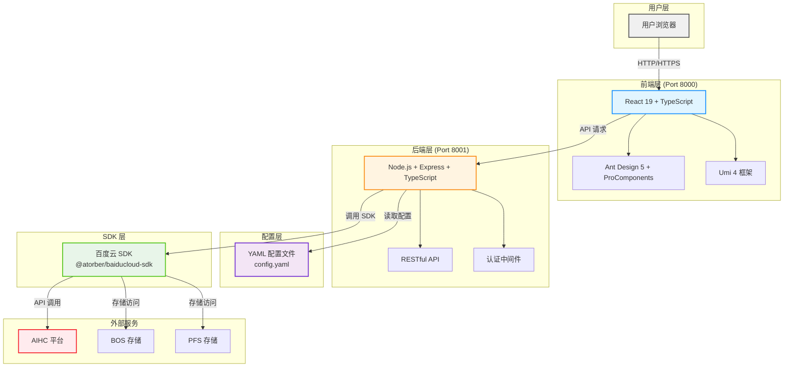

让我聊聊为什么会有这个项目...

<!-- truncate -->

## 开发者工具产品经理的视角

作为开发者工具产品经理，一直关注如何帮助开发者更好地提升工作效率，降低系统集成和二次开发的门槛。

但在实际使用中，我们发现很多企业和个人在构建自定义平台时，会因为业务或技术的限制难以实现个性化需求：

- 不知道如何调用API
- 不懂开发，不知道如何构建前后端服务  
- 官方最佳实践匮乏
- 对原生平台的设计逻辑理解不透彻

**MPL-COOKER 的初衷**，就是希望通过对 OpenAPI 的规范化利用，整理出一套行之有效的最佳实践，帮助用户用最少的精力、最清晰的路径把分布式平台搭建起来。

无论是接口聚合、自动化生成代码，还是权限管理、平台扩展，MPL-COOKER 都可以作为一个开箱即用的模板和创新范例，演示现代平台如何高效、灵活地对接各种服务。

## 机器学习平台使用者的痛点

作为机器学习平台的使用者，我们也深深体会到无论原生平台在易用性、体验上如何努力，依然无法满足不同客户的个性化使用需求。

市面上的机器学习平台为了满足不同客户的需求往往功能繁复、操作冗长，对于需要快速试错和实验的科研、工程用户来说，却往往仅需要极少的与自身业务相关的功能和操作。

我们希望拥有的是一个简单、开箱即用的平台，能让自己专注在模型的构建和实验，而不是被运维、配置、琐碎的接口调用所困扰。

## 愿景

MPL-COOKER 针对这一痛点，力求以极简的设计理念，为用户提供清晰的操作流程和开源的可定制空间，在项目基础上任何人可以借助vibe coding工具快速进行二次开发，打造自己专属的机器学习平台。

希望这个项目，从个人个性化体验出发，真正能够让更多人享受到高效易用的机器学习开发体验，同时通过社区的共创，反哺原生平台体验。

## MPL-COOKER的实现架构

1. 基于 Node.js + TypeScript + React 实现，你可以将本项目作为一个脚手架使用，在此基础上继续添加新的功能，甚至不需要懂开发，使用AI IDE用聊天的方式开发

2. 没有使用数据库，数据在本地使用json文件存储，所以不用担心不会部署

更多介绍移步 [项目概览](../docs/概览)
