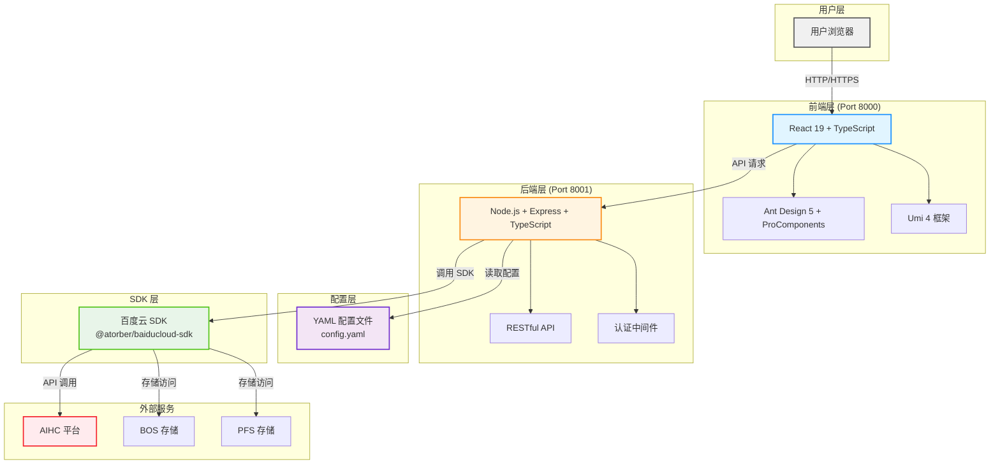

# 概览

基于 Node.js + TypeScript + React 的现代化机器学习平台管理系统,提供完整的 AIHC 平台资源管理功能,支持部署、训练、任务、数据集、模型等全生命周期管理。

{/* 
  系统架构图 - 使用 Mermaid 代码绘制
  编辑说明：
  1. 修改节点：更改方括号 [] 中的文本即可修改节点名称
  2. 添加节点：复制现有节点行，修改名称和连接关系
  3. 修改连接：修改箭头 --> 和连接标签 |标签|
  4. 修改样式：修改 style 行中的颜色代码（十六进制）
  5. 添加分组：使用 subgraph "分组名" ... end 包裹节点
  6. 更多语法：参考 https://mermaid.js.org/
*/}

## 核心功能模块

- 🚀 **部署管理**：服务部署和管理,支持在线服务的创建、查询、删除和状态监控
- ⚡ **训练管理**：训练任务的创建、查询、停止和管理,支持分布式训练
- 📋 **任务管理**：批量任务管理,自动筛选和管理以 "task-" 开头的任务
- 💾 **数据集管理**：数据集的上传、查询、版本管理,支持 BOS 和 PFS 存储
- 🤖 **模型管理**：模型的创建、查询、版本管理
- 🐳 **镜像管理**：预置镜像的查询和管理
- 📦 **应用模板**：丰富的应用模板库,支持一键部署、训练和任务创建
- 🖥️ **计算资源**：队列和资源池管理,实时查看资源使用情况
- ⚙️ **系统设置**：统一的配置管理,支持 YAML 配置文件

## 技术特性

### 前端特性
- ✅ **Ant Design Pro**：企业级中后台前端解决方案
- ✅ **React 19 + TypeScript**：类型安全的现代 React 开发
- ✅ **Umi 4**：企业级 React 应用框架
- ✅ **ProComponents**：重度封装的业务组件
- ✅ **响应式设计**：支持移动端和桌面端
- ✅ **热重载**：开发时自动刷新
- ✅ **国际化支持**：中英文切换

### 后端特性
- ✅ **Node.js + Express**：高性能后端服务
- ✅ **TypeScript**：类型安全的开发体验
- ✅ **RESTful API**：标准化的 API 接口
- ✅ **YAML 配置管理**：统一的配置文件管理
- ✅ **百度云 SDK 集成**：基于 `@atorber/baiducloud-sdk` 的 AIHC 平台集成
- ✅ **认证中间件**：基于 AK/SK 的认证机制
- ✅ **CORS 支持**：跨域请求支持
- ✅ **错误处理**：统一的错误处理机制
- ✅ **日志记录**：完整的日志记录系统

## 架构说明

本项目采用现代化的前后端分离架构：

### 后端架构
- **框架**: Node.js + Express + TypeScript
- **配置**: YAML 配置文件（`config.yaml`）
- **SDK**: 百度云 SDK（`@atorber/baiducloud-sdk`）
- **API**: RESTful API 接口
- **端口**: 默认 8001（可在配置中修改）

### 前端架构
- **框架**: React 19 + TypeScript
- **UI库**: Ant Design 5 + ProComponents
- **构建工具**: Umi 4 (Max)
- **HTTP客户端**: 内置请求库
- **端口**: 默认 8000（开发环境）

## 环境要求

### 后端环境
- Node.js >= 20.0.0
- npm >= 8.0.0
- TypeScript >= 5.0.0

### 前端环境
- Node.js >= 20.0.0
- npm >= 8.0.0

## 技术栈

### 后端
- Node.js 20+
- Express 5
- TypeScript 5
- js-yaml (YAML 配置管理)
- @atorber/baiducloud-sdk (百度云 SDK)

### 前端
- React 19
- TypeScript 5
- Ant Design 5
- ProComponents
- Umi 4 (Max)
- @biomejs/biome (代码格式化)
