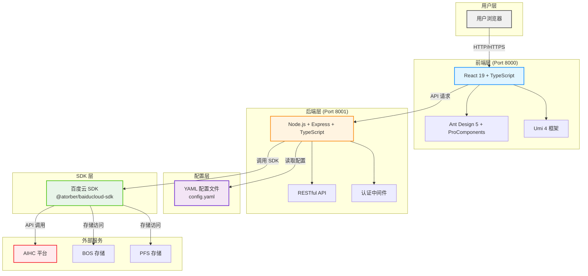

# 概览

**MLP Cooker** 是一站式机器学习平台管理系统，基于 Node.js + TypeScript + React 构建，提供完整的 AIHC 平台资源管理功能，支持部署、训练、任务、数据集、模型等全生命周期管理。

## 产品定位

面向使用百度百舸 AIHC 平台的团队与开发者，提供：

- **统一控制台**：在一个界面中管理推理服务、训练任务、批量任务、数据集与模型
- **应用 + 模板**：应用一键执行，配置由模板库的 `template_content` 统一管理
- **资源与存储**：队列、资源池、开发机、训练/部署，以及存储桶 / PFS 浏览
- **配置集中**：全局配置 + 系统设置（YAML / AK/SK），便于本地或内网部署

## 产品价值

- **提效**：统一入口完成日常运维与资源管理，减少在多处控制台间的切换
- **标准化**：通过「应用引用模板」固化最佳实践，配置集中在模板库，执行入口保持轻量
- **数据版本化**：深度集成 lakeFS，支持对 BOS 等存储进行 Git-like 的版本管理（分支、合并、回滚）
- **隔离与安全**：支持多 AK/SK 认证与租户级隔离，确保不同项目的资源与配置安全
- **可观测**：集中查看队列、资源池、加速卡与 CPU/内存使用，便于容量与成本管理
- **可落地**：支持本地或内网部署，配置与认证（AK/SK）集中管理，便于与现有流程集成

## 系统架构

```mermaid
graph TB
    subgraph "用户层"
        User[用户浏览器]
    end
    
    subgraph "前端层 (Port 8000)"
        Frontend[React 19 + TypeScript]
        UI[Ant Design 5 + ProComponents]
        Umi[Umi 4 框架]
        Frontend --> UI
        Frontend --> Umi
    end
    
    subgraph "后端层 (Port 8001)"
        Backend[Node.js + Express + TypeScript]
        API[RESTful API]
        Auth[认证中间件]
        Backend --> API
        Backend --> Auth
    end
    
    subgraph "配置层"
        Config[YAML 配置文件<br/>config.yaml]
    end
    
    subgraph "SDK 层"
        SDK[百度云 SDK<br/>@atorber/baiducloud-sdk]
    end
    
    subgraph "外部服务"
        AIHC[AIHC 平台]
        BOS[BOS 存储]
        PFS[PFS 存储]
    end
    
    User -->|HTTP/HTTPS| Frontend
    Frontend -->|API 请求| Backend
    Backend -->|读取配置| Config
    Backend -->|调用 SDK| SDK
    SDK -->|API 调用| AIHC
    SDK -->|存储访问| BOS
    SDK -->|存储访问| PFS
    
    style Frontend fill:#e1f5ff,stroke:#1890ff,stroke-width:2px
    style Backend fill:#fff4e1,stroke:#fa8c16,stroke-width:2px
    style Config fill:#f3e5f5,stroke:#722ed1,stroke-width:2px
    style SDK fill:#e8f5e9,stroke:#52c41a,stroke-width:2px
    style AIHC fill:#ffebee,stroke:#f5222d,stroke-width:2px
    style User fill:#f0f0f0,stroke:#595959,stroke-width:2px
```

## 核心功能模块

- 🚀 **部署管理**：在线服务创建、查询、删除与状态监控
- ⚡ **训练管理**：训练任务创建、查询、停止与 WebTerminal 等运维能力
- 📋 **任务管理**：批量任务管理（过滤 `task-` 关键字任务）
- 💾 **AI资产**：数据集、模型、镜像、任务
- 🗄️ **数据仓库**：LakeFS 仓库、分支、对象与提交
- 📦 **应用**：可执行入口，通过 `templateId` 引用模板配置一键发起任务
- 🧩 **模板**：预置 / 自定义模板库，`template_content` 保存应用配置参数
- 🖥️ **资源**：开发机、部署、训练、队列、资源池、存储（桶 / PFS）
- ⚙️ **全局配置 / 系统设置**：默认资源与 AK/SK 等集中管理

## 技术特性

### 前端特性
- ✅ **Ant Design Pro**：企业级中后台前端解决方案
- ✅ **React 19 + TypeScript**：类型安全的现代 React 开发
- ✅ **Umi 4**：企业级 React 应用框架
- ✅ **ProComponents**：重度封装的业务组件
- ✅ **响应式设计**：支持移动端和桌面端
- ✅ **热重载**：开发时自动刷新
- ✅ **国际化支持**：中英文切换

### 后端特性
- ✅ **Node.js + Express**：高性能后端服务
- ✅ **TypeScript**：类型安全的开发体验
- ✅ **RESTful API**：标准化的 API 接口
- ✅ **YAML 配置管理**：统一的配置文件管理
- ✅ **百度云 SDK 集成**：基于 `@atorber/baiducloud-sdk` 的 AIHC 平台集成
- ✅ **多 AK/SK 认证**：支持多套凭证管理与租户级资源隔离机制
- ✅ **lakeFS 数据版本化**：支持 PB 级数据集的 Git-like 版本控制
- ✅ **CORS 支持**：跨域请求支持
- ✅ **错误处理**：统一的错误处理机制
- ✅ **日志记录**：完整的日志记录系统

## 架构说明

本项目采用现代化的前后端分离架构：

### 后端架构
- **框架**: Node.js + Express + TypeScript
- **配置**: YAML 配置文件（`config.yaml`）
- **SDK**: 百度云 SDK（`@atorber/baiducloud-sdk`）
- **API**: RESTful API 接口
- **端口**: 默认 8001（可在配置中修改）

### 前端架构
- **框架**: React 19 + TypeScript
- **UI库**: Ant Design 5 + ProComponents
- **构建工具**: Umi 4 (Max)
- **HTTP客户端**: 内置请求库
- **端口**: 默认 8000（开发环境）

## 环境要求

### 后端环境
- Node.js >= 20.0.0
- npm >= 8.0.0
- TypeScript >= 5.0.0

### 前端环境
- Node.js >= 20.0.0
- npm >= 8.0.0

## 技术栈

### 后端
- Node.js 20+
- Express 5
- TypeScript 5
- js-yaml (YAML 配置管理)
- @atorber/baiducloud-sdk (百度云 SDK)

### 前端
- React 19
- TypeScript 5
- Ant Design 5
- ProComponents
- Umi 4 (Max)
- @biomejs/biome (代码格式化)
